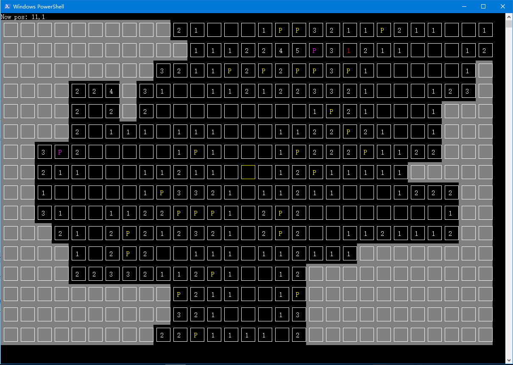

# MinesweeperLocal
This is a prepared project for MinesweeperOnline.

## Summary
Although this is a prepared project for MinesweeperOnline, it can be played in some ways.  

**WARNING**  
This software's working method might **totally** damage your eyesight. Don't play too long.  

## Running game
Open console at root folder and run ```dotnet run``` to run this game.  
This game provide some choices for creating new map or loading stored map. But this application don't provide any interface to change map's default difficulty. So if you want to change map's difficulty, you should modify code by yourself. Some typical difficulty's value has been created in class Map. You can use it directly. The code about generating map's difficulty is defined in Program.cs. You can see it obviously.  
If you want to change specific map's difficulty. You should read code to know minesweeper.dat's structure and modify it directly.  
Also, this app don't provide and options to change minesweeper's map's location. It will be forced to be stored at root folder.\(File .gitignore has ignored all game's file\)  

## How to play it
Use WASD to control the cursor. The cursor's postion is signed by a yellow cell.  
Use Enter to open cell and use Space to set/delete flag from cell.  
When you touch mine, you will alive and error mine will be marked by red cell.  

## Screenshot

