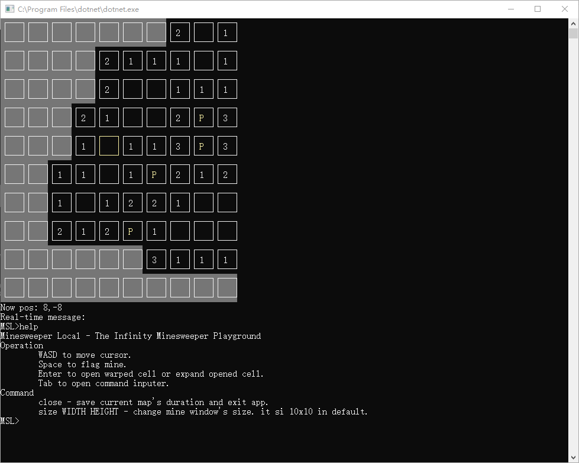

# MinesweeperLocal

The infinity minesweeper playground.

## Summary

Although this is a prepared project for MinesweeperOnline, it can be played in some ways.

**WARNING**  
This software's working method might **totally** damage your eyesight. Don't play too long.  
(EDIT: We have used new draw function now. And this app will not flash screen when you moving or doing some operations. But I still suggest that you shouldn't play it too long.)

## Running game

Open console at root folder and run ```dotnet run``` to run this game.

This game provide some choices for creating new map or loading stored map. But this application don't provide any interface to change map's default difficulty. So if you want to change map's difficulty, you should modify code by yourself. Some typical difficulty's value has been created in class Map. You can use it directly. The code about generating map's difficulty is defined in Program.cs. You can see it obviously.

If you want to change specific map's difficulty. You should read code to know minesweeper.dat's structure and modify it directly.

Also, this app don't provide and options to change minesweeper's map's location. It will be forced to be stored at root folder.\(File .gitignore has ignored all game's file\)

## How to play it

Use WASD to control the cursor. The cursor's postion is signed by a yellow cell.

Use Enter to open cell and use Space to set/delete flag from cell.

Use Tab to open command inputer. Use `size` command to change display size and `close` command to exit game normally.

This game will info you that you do a wrong things(touch a mine or flag a blank cell). This is not like traditional minesweeper. Please mind this. I set this method because this is not serve for traditional minesweeper. This app is serve for my Minesweeper Online project and it don't need the function, that touching mine will kill your gaming tour. (This function is uncomperhensible and ugle now. But the following functions, such as combo, will change this situation).

## Screenshot


